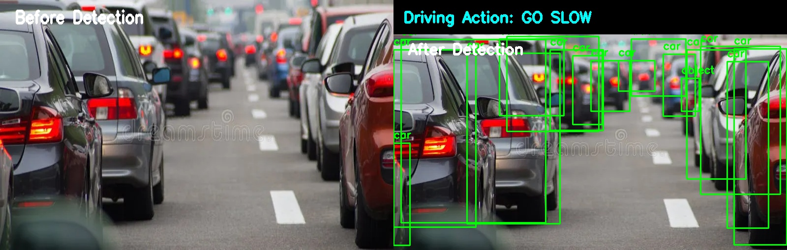
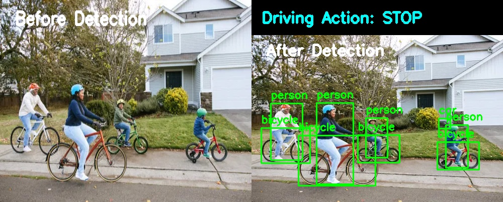
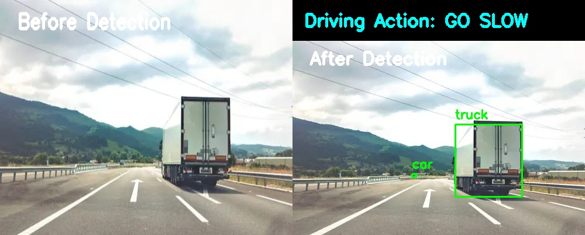
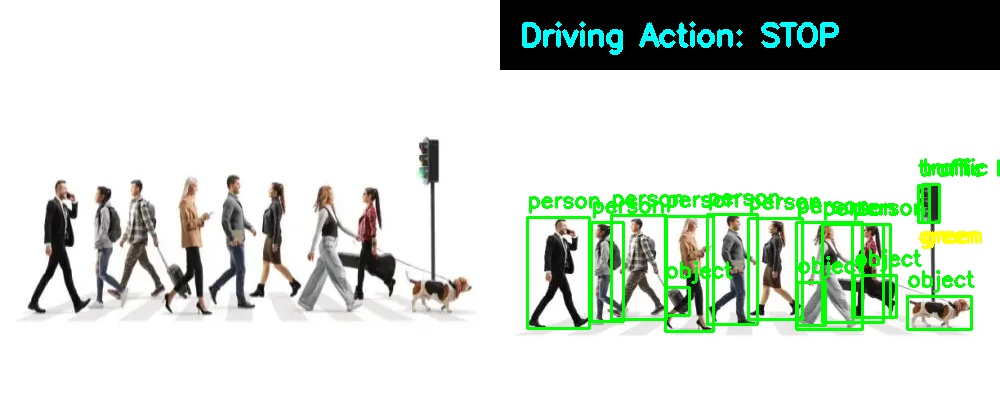
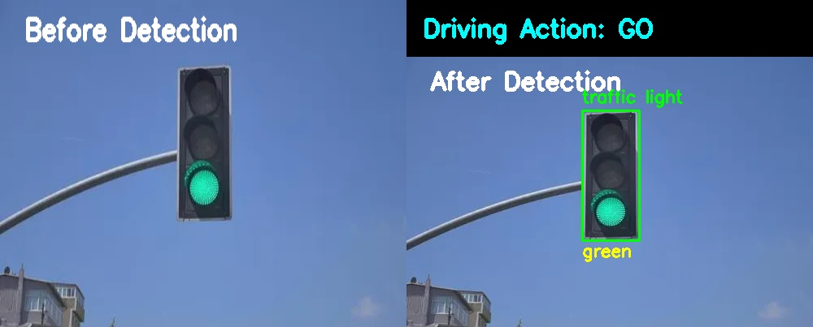
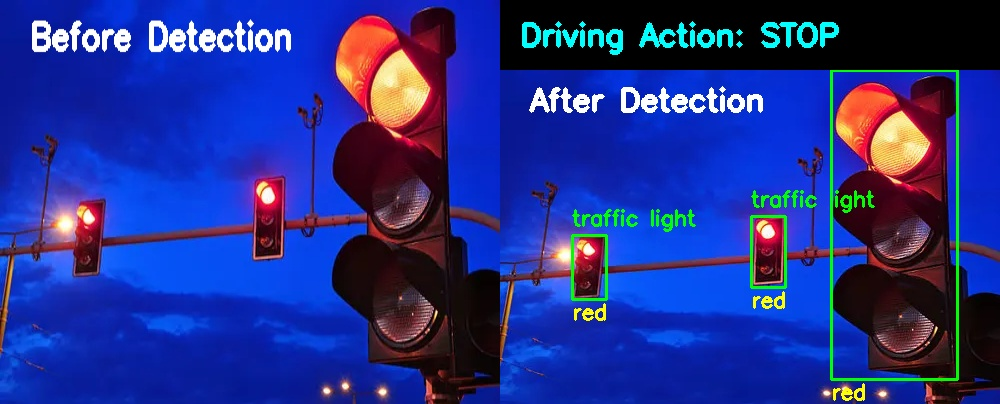
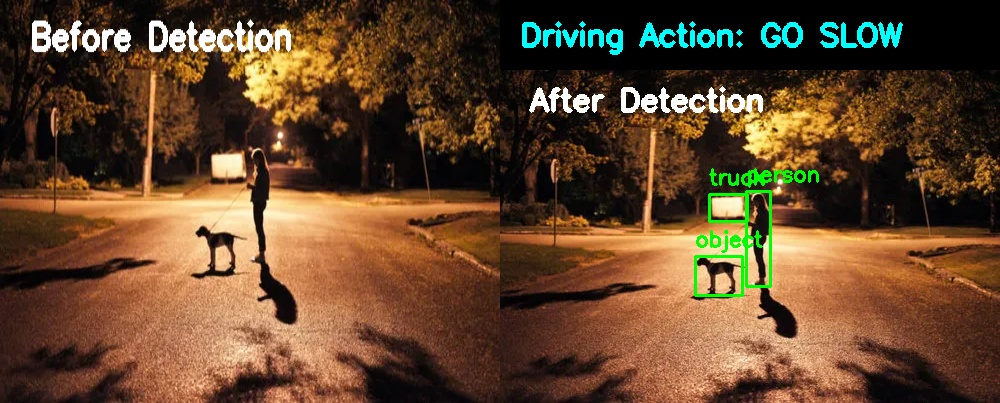

# Speed & Seed: Optimizing Faster R-CNN for Small Object Detection Where Vision Leads

## Overview
This project focuses on improving small object detection in autonomous driving using Faster R-CNN. It detects objects such as vehicles, pedestrians, traffic lights, and trucks, then generates a driving action such as GO, GO SLOW, or STOP based on the detected scene.

## Problem Statement
Small objects in road scenes are difficult to detect because they occupy few pixels, are often occluded, and appear in complex backgrounds. This project explores a Faster R-CNN based solution to improve detection performance in autonomous driving environments.

## Objectives
- Improve small object detection accuracy
- Use Faster R-CNN for object detection
- Detect traffic light color
- Generate action-based driving response
- Display before and after detection output images

## Methodology
1. Load traffic images from Google Drive
2. Run Faster R-CNN detection
3. Detect traffic light colors using HSV analysis
4. Apply driving rules:
   - Red light / person / animal → STOP
   - Yellow light / truck → GO SLOW
   - Green light → GO
5. Save the combined before-and-after output image

## Tools Used
- Python
- Google Colab
- PyTorch
- Torchvision
- OpenCV
- NumPy
- Matplotlib

## Detection Results

### 1. Traffic Congestion Scene

**Driving Action:** GO SLOW

---

### 2. Bicycle and Pedestrian Scene

**Driving Action:** STOP

---

### 3. Truck on Highway

**Driving Action:** GO SLOW

---

### 4. Pedestrian Crossing Scene

**Driving Action:** STOP

---

### 5. Green Traffic Light

**Driving Action:** GO

---

### 6. Traffic Lights at Night

**Driving Action:** STOP

---

### 7. Night Road with Dog

**Driving Action:** GO SLOW
## Future Scope
- Use KITTI or BDD100K dataset
- Add video-based detection
- Improve small object detection with multi-scale feature learning
- Deploy in real-time autonomous driving scenarios

## Author
Kandula Sohan
